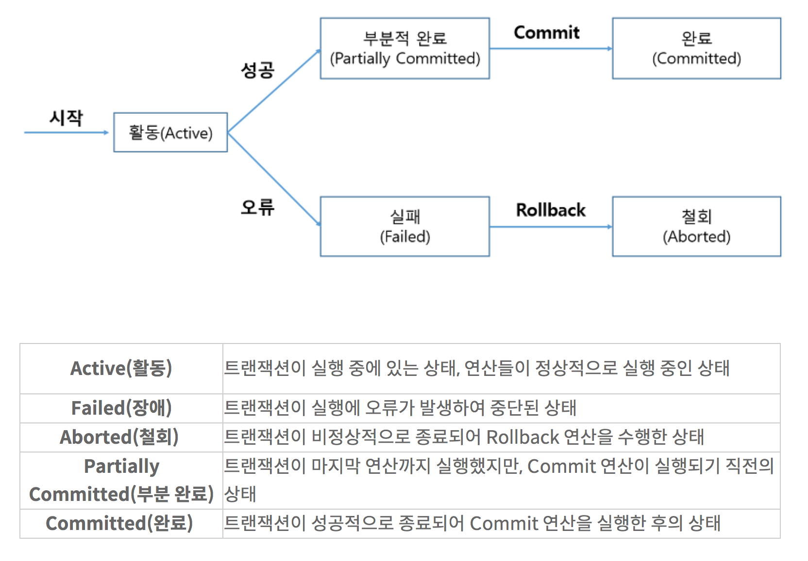

# Transaction이란?

- DB의 상태를 변환시키는 하나의 논리적인 작업 단위를 구성하는 연산들의 집합이다. 
예를 들어, A계좌에서 B계좌로 일정 금액을 이체한다고 가정하자. 이러한 과정은 다음과 같다

    
            ​ a. A계좌의 잔액 확인
            
            ​ b. A계좌의 금액에서 이체할 금액을 빼고 다시 저장
            
            ​ c. B계좌의 잔액을 확인
            
            ​ d. B계좌의 금액에서 이체할 금액을 더하고 다시 저장

- a~d의 과정들은 모두 합쳐저 계좌이체라는 하나의 작업단위(트랜잭션)을 구성, 트랜잭션은 항상 all or nothing 원칙을 만족해야 한다.  
즉 완료를 하던가(commit) 다시 원래의 상태로 돌아가던가(rollback) 둘중 하나는 만족해야 한다.  
절대 partoally Done 형태로 끝나서는 안된다.

- 게시판을 예로 들어보자. 
게시판 사용자는 게시글을 작성하고, 올리기 버튼을 누른다. 그 후에 다시 게시판에 돌아왔을때, 
게시판은 자신의 글이 포함된 업데이트된 게시판을 보게 된다. 
이러한 상황을 데이터베이스 작업으로 옮기면, 사용자가 올리기 버튼을 눌렀을 시, Insert 문을 사용하여 
사용자가 입력한 게시글의 데이터를 옮긴다. 그 후에, 게시판을 구성할 데이터를 다시 Select 하여 최신 정보로 
유지한다. 여기서 작업의 단위는 insert문과 select문 둘다 를 합친것이다. 이러한 작업단위를 하나의 트랜잭션이라 한다. 

## 트랜잭션의 성질(ACID)

- Atomicity(원자성) , All or Nothing
            
            
            트랜잭션의 모든 연산들은 정상적으로 수행 완료되거나 아니면 전혀 어떠한 연산도 수행되지 않은 상태를 보장해야 한다.
            
- Consistency(일관성)
            
            
            트랜잭션 완료 후에도 데이터베이스가 일관된 상태로 유지되어야 한다. 예를 들어 계좌이체를 성공적으로 실행했다면
            A계좌 잔액과 B계좌 잔액의 합이 트랜잭션 실행 전의 합과 동일해야 한다.
            
- Isolation(독립성)
  
            
            하나의 트랜잭션이 실행하는 도중에 변경한 데이터는 이 트랜잭션이 완료될 때까지 다른 트랜잭션이 참조하지 못한다.
            DB는 클라이언트들이 같은 데이터를 공유하는 것이 목적이므로 여러 트랜잭션이 동시에 수행된다. 
            이 때 트랜잭션은 상호 간의 존재를 모르고 독립적으로 수행되어야 한다. 또한 트랜잭션이 실행중인 데이터는 다른 트랜잭션이 
            동시에 참조하지 못하도록 보장하여야 한다.
            
- Durability(지속성)
  
            
            성공적으로 수행된 트랜잭션은 영원히 반영되어야 한다. 즉 완료된 트랜잭션의 결과는 디스크와 같은 보조기억장치에 저장되거나
            시스템 장애가 회복되고 난 후에 어떠한 형태로든지 그 데이터를 복구 할 수 있어야 한다.

## 트랜잭션의 Commit, Rollback 연산

- Commit이란 하나의 트랜잭션이 성공적으로 끝났고, 데이터베이스가 일관성있는 상태에 있을 때, 하나의 트랜잭션이 끝났다라는 것을 
려주기위해 사용하는 연산이다. 이 연산을 사용하면 수행했던 트랜잭션이 로그에 저장되며, 후에 Rollback 연산을 수행했었던 트랜잭션단위로 하는것을 도와준다. 
Rollback이란 하나의 트랜잭션 처리가 비정상적으로 종료되어 트랜잭션의 원자성이 깨진경우, 트랜잭션을 처음부터 다시 시작하거나, 
트랜잭션의 부분적으로만 연산된 결과를 다시 취소시킨다. 
후에 사용자가 트랜잭션 처리된 단위데로 Rollback을 진행할 수도 있다.

## 두개 이상의 트랜잭션이 발생 할 경우
 
- 트랜잭션 스케쥴을 이용하거나 Lock이용해 관리한다.

- 트랜잭션 스케쥴

            직렬 스케줄의 경우에는 트랜잭션의 연산을 모두 순차적으로 실행하는 유형, 즉 하나의 트랜잭션이 실행되면 해당 트랜잭션이 완료되어야 다른 트랜잭션이 실행
            비직렬 스케쥴은 트랜잭션의 직렬 수행순서와 상관없이 병행 수행하는 스케쥴을 의미
            직렬가능 스케쥴은 서로 영향을 주지 않는 직렬 스케줄을 비 직렬적으로 수행
- Lock

            여러개의 트랜잭션들이 하나의 자원으로 동시에 접근할 때 이를 제어해주는 도구
            락은 읽기를 할 때 사용하는 공유락과 읽고 쓰기를 할 때 사용하는 배타락으로 나뉘어짐
            로킹 단위가 크면 로크 수가 작아 관리하기 쉽지만 병행성이 낮아짐, 작으면 관리가 어렵고 병행성이 높아짐
            락이 걸려있는 데이터에 접근하는 트랜잭션은 대기 상태가 된다.
            다수의 트랜잭션이 동시에 수행되다 보며, 교착상태에 빠질 위험이 있다. 일반적인 DBMS에서는 교착상태를 검출하여 보고한다.
            교착 상태의 빈도를 낮추기 위해서는 트랜잭션을 자주 커밋하고, 정해진 순서로 테이블에 접근 할 수 있도록 하는것이 좋다.

