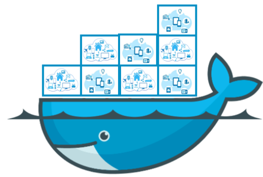

# Docker

- 한줄로 설명하자면 한 환경에서 독립된 여러 환경을 제공해주는 기술이라고 할 수 있다. 
도커라는 기술이 나오게 된 배경과 주목받는 이유는 MSA라는 아키텍처의 등장과 함께라고 할 수 있다.

- MSA는 "하나의 큰 어플리케이션을 여러개의 작은 어플리케이션으로 쪼개어 변경과 조합이 가능하도록 만든 아키텍쳐"인데 
결제는 Node.js로 회원은 Python으로 배송은 Java로 각각 독립적으로 구성된 환경에서 이 모든 환경을 하나의 컴퓨터에 
모두 설치하기에는 부담스럽다. 그렇기 때문에 각각에 서비스에 맞는 언어나 환경을 최적의 환경을 제공하기 위해서 도커를 사용해서 
독립된 환경을 구성하는 것이다.  

## Docker 와 VM(가상머신)의 차이

- VM(가상머신)은 하나의 물리적 컴퓨터 위 -> 해당 컴퓨터의 호스트 OS 위 -> 하이퍼바이저를 기반으로 각각 OS를 가동하는 각각의 컴퓨터들이 
호스트 OS의 물리적 컴퓨터 자원을 분할해서 쓰기때문에 성능에 한계가 생기게 된다. 즉 내 컴퓨터의 호스트 OS위에 하이퍼바이저를 올리고 
그 위에 각자 원하는 게스트 OS들을 설치하여 구동하는데, 도커는 호스트 OS위에 도커엔진을 얹고 그 위에서 실행환경만 독립적으로 구동시키기 때문에 
VM과의 성능차이는 없지만 훨씬 가볍고 빠르게 구동될 수 있다. 즉 호스트 OS위에 분리된 OS를 갖는 것이 아니라 호스트 OS위에 분리된 "환경(컨테이너)" 
들을 갖는 것이다.

- 도커는 기본적으로 리눅스의 컨테이너 기술 기반으로 리눅스에서 보통 사용된다.
- 로컬 컴퓨터에서 ubuntu 도커 이미지를 다운받아 실행하고 그 이미지에서 nginx를 설치해 웹서버를 구동하고 해당 컨테이너와 로컬의 80 포트를 연결해준다면 
브라우저를 통해 localhost로 접속했을 때 기본적으로 http 요청은 80포트로 연결되고 요청은 컨테이너로 구동중인 nginx가 처리해서 화면을 볼 수 있게 되는 
시나리오로 생각된다. (틀릴 수 있음)

- 컴퓨터에 필요한 프로그램들을 설치할 때 잘못 설치했거나 변경이 필요할 때 상당히 복잡하지만 도커에서는 그렇게 필요한 애플리케이션들이 설치된 컨테이너를 
날려버리고(삭제하고) 부담없이 새로 구성하면 된다.

## 쿠버네티스란(미완성)
- 도커로 한개의 컨테이너를 운영할 때는 사실상 필요가 없다. 하지만 여러 컨테이너를 관리하고 운영할때 관리를 도와주는 것이 쿠버네티스이다. 

## 용어들
- 이미지
    - 각 os를 실행하기 위한 파일들을 모아둔 것으로 필요에따라 nginx, DB, 실행환경파일들이 구성되어있는 상태
    
- 컨테이너
    - 이미지가 실행된 상태, 구동된 상태
    
- 클래스와 인스턴스라고 생각하면 쉽다. 구성된 파일로 있으면 이미지, 이미지가 메모리에 올라가 실행된 상태면 컨테이너

- 도커 허브
    - 깃허브처럼 도커 이미지들이 모여있는 아카이브, 저장소

- docker search "keyword"
    - 도커 허브에서 해당 키워드의 이미지들을 찾는다

- docker pull "keyword"
    - 도커 허브에서 해당 키워드를 다운받는다. 버젼을 명시하지 않으면 최신 버전

- docker images
    - 현재 pc에 있는 image 목록을 보여준다

- docker run -i -t --name hello ubuntu /bin/bash
    - 이미지를 hello라는 이름으로 ubuntu라는 이미지를 /bin/bash 환경으로 실행, 컨테이너화한다.

- docker ps
    - 현재 활성화 되어있는 컨테이너 목록

- 컨테이너에 접속해서 exit 명령으로 컨테이너에서 빠져나왔다고 해도 정지가 된 것이지 메모리에서 사라진 것은 아니다.

- docker ps -a 
    - 메모리상에 있는 컨테이너들을 볼 수 있다.

- docker restart hello
    - 컨테이너 재시작(환경으로 접속은 아니다.)

- docker attach hello
    - 해당 컨테이너에 다시 접속

- docker stop hello
- 해당 컨테이너를 정지시킨다, 역시 메모리에는 올라가있는 상태

- docker rm hello
    - 메모리에서 hello 컨테이너를 제거한다.

- docker rmi ubuntu
    - ubuntu라는 이미지를 지운다.