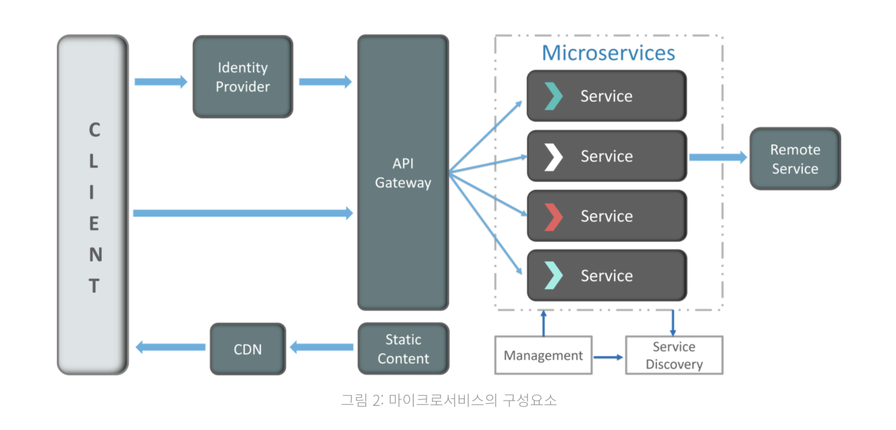

# MSA란?

"하나의 큰 어플리케이션을 여러개의 작은 어플리케이션으로 쪼개어 변경과 조합이 가능하도록 만든 아키텍쳐"

- 레고와 같이 작은 레고블록(Microservice) 하나하나를 붙여 어떠한 큰 결과물을 만드는 형태이다.

- MSA가 등장하기전 기존 아키텍처는 소프트웨어의 모든 구성요소가 한 프로젝트에 통합되어있는 형태입니다. 
이러한 아키텍처를 Monolithic Architecture 이라 하는데 모놀리틱 아키텍처는 아래와 같은 한계가 있다.

            서비스/프로젝트가 커지면 커질수록, 영향도 파악 및 전체 시스템 구조의 파악에 어려움이 있다.
            빌드 시간 및 테스트시간, 그리고 배포시간이 기하급수적으로 늘어나게 된다.
            서비스를 부분적으로 scale-out하기가 힘들다.
            부분의 장애가 전체 서비스의 장애로 이어지는 경우가 발생하게 된다.

- 이러한 모놀리틱 아키텍처의 한계를 극복하기 위해 MSA가 등장하게 되었다.

            "the microservice architectural style is an approach to developing a single application as a suite of small services,
             each running in its own process and communicating with lightweight mechanisms, often an HTTP resource API.
             These services are built around business capabilities and independently deployable by fully automated 
             deployment machinery." - Martin Folwer
             
- small services, each running in its own process(스스로 돌아 갈 수 있는 작은 서비스) 와,  
independently deployable(독립적 배포 가능)이 핵심이라고 할 수 있다.

- 즉 각각의 서비스는 그 크기가 작을 뿐, 서비스 자체는 하나의 모놀리틱 아키텍쳐와 유사한 구조를 가지고 
각각의 서비스는 독립적으로 배포가 가능해야하며, 각각의 서비스는 다른 서비스에 대한 의존성이 최소화 되어야 함 
각 서비스는 개별 프로세스로 구동 되며, REST와 같은 가벼운 방식으로 통신되어야 함.

- MSA 아키텍쳐 1

- MSA 아키텍쳐 2

## msa의 장점

- 배포(deployment) 관점
    - 서비스 별 개별 배포 가능 ( 배포 시 전체 서비스의 중단이 없음)
    - 요구사항을 신속하게 반영하여 빠르게 배포할 수 있음.
- 확장(scaling) 관점
    - 특정 서비스에 대한 확장성이 용이함.
    - 각각의 서비스는 사업 영역에 맞게 자신만의 데이터베이스를 가지고 있다.
    - API를 제공해 각각의 서비스가 다른 서비스의 데이터베이스에 접근하도록 한다.
    - 클라우드 사용에 적합한 아키텍쳐.
- 장애(failure) 관점
    - 장애가 전체 서비스로 확장될 가능성이 적음
    - 부분적 장애에 대한 격리가 수월함
    - 따라서 SOA(Service Oriented Architecture)의 특징을 다수 공통으로 가잔다.
- 마이크로서비스는 가볍다
    - 제대로 설계된 마이크로서비스는 하나의 비즈니스 범위에 맞춰 만들어지므로 하나의 기능만 수행한다.
    - 그 결과 대부분의 마이크로서비스 구현체에서 볼 수 있는 공통적인 특징 중 하나는 마이크로서비스가 작은 공간만을 차지한다는 점이다.
    
## msa의 단점
- 성능
    - 서비스 간 호출 시 API를 사용하기 때문에, 통신 비용이나, Latency가 그만큼 늘어나게 된다.
- 테스트 / 트랜잭션 
    - 서비스가 분리되어 있기 때문에 테스트와 트랜잭션의 복잡도가 증가하고, 많은 자원을 필요로 한다.
- 데이터 관리
    - 데이터가 여러 서비스에 걸쳐 분산되기 때문에 한번에 조회하기 어렵고, 데이터의 정합성 또한 관리하기 어렵다.

- API Gateway 가 가져야 하는 가장 기본적인 기능은 인증 및 인가에 대한 처리를 하는 기능이다. 
모놀리틱 아키텍쳐였다면 해당 어플리케이션에서 스프링 시큐리티, 또는 자체 구현한 필터 및 인터셉터로 인증 및 인가에 
대한 처리를 할 수 있지만, 마이크로서비스 아키텍쳐를 기반으로 나눠진 수 많은 API 각각마다 이런 구현을 하게 되면 
엄청난 소스의 중복 및 유지보수에 악영향이 발생하게 된다. 
그래서 인증 및 인가에 관련된 기능이 API Gate Way에 들어가게 되는 것이다.

            ex_1) 서로 다른 서비스는 동일한 기술의 다른 버전을 사용할 수 있다. 어떤 마이크로 서비스는 자바 1.7, 다른 마이크로서비스는 자바 1.8로 적용할 수 있다.
            
            ex_2) 서로 다른 서비스는 서로 다른 언어로 개발될 수 있다. 예를 들어 어떤 마이크로서비스는 자바로 개발되고, 다른 마이크로서비스는 스칼라로 개발될 수 있다.
            
            ex_3) 서로 다른 마이크로서비스는 서로 다른 아키텍처를 적용할 수 있다. 예를 들어 어떤 마이크로서비스가 데이터의 신속한 서비스를 위해 Redis 캐시를 사용하는 반면에
             다른 마이크로서비스는 데이터 스토어로 MySQL을 사용할 수도 있다.