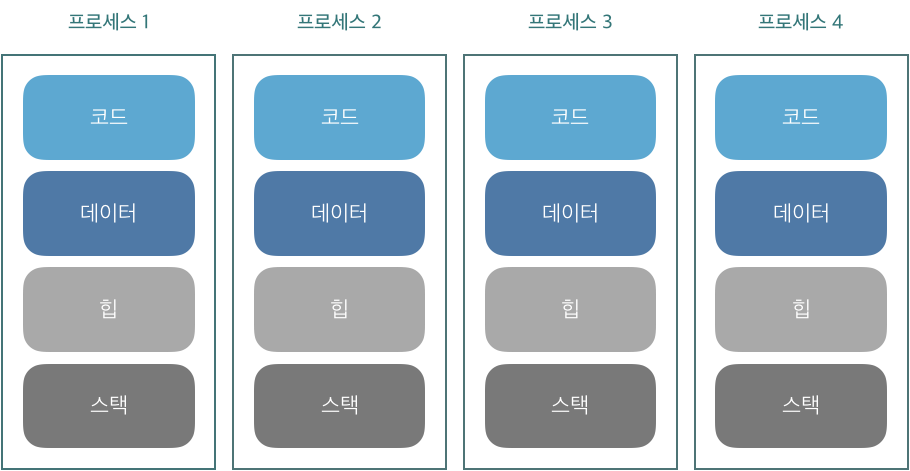

# 쓰레드(Thread)

- 스레드란 프로세스안의 "실행흐름의 단위"로, 스케쥴러에 의해 CPU를 할당받을 수 있는 인스트럭션의 나열이다. 
프로세스는 하나 이상의 스레드로 구성된다. 또한 프로세스가 PCB를 갖는 것처럼, 스레드는 스레드 제어 블록(TCB)를 
갖는다. 
    - TCB에는 스레드 상태정보, 프로세스 PCB 주소등이 저장되어 있음
    - 프로세스 상태나 컨텍스트 스위칭이 스레드에도 똑같이 적용되는데 단일 스레드로 작동하면 프로세스와 스레드의 차이는 없다.
    
    
## 멀티 프로세스와 멀티 스레드

- 단일코어 CPU에서 입출력, 네트워크, UI, 데이터 분석등 여러개의 실행흐름이 동시에 필요하고, 이러한 실행흐름 사이에서 
데이터를 공유해야할 때 여러 실행흐름을 구현하려면 멀티프로세스 혹은 멀티스레드로 구현해야 한다.
    - 코어 : CPU에 내장된 처리회로의 핵심, 듀얼코어란 1개의 CPU에 처리회로가 2개
    
- 멀티 프로세스는 서로 독립적인 메모리 공간을 가지므로 기본적으로 데이터를 공유할 수 없다.
    - 없진 않다. 모든 프로세스가 서로 다른 메모리 공간을 가지므로 데이터를 공유하려면 특별한 기법을 사용해야 한다.
    

- 프로세스간 통신이란 프로세스들간에 데이터 및 정보를 주고받기위한 메커니즘을 말한다.
    - IPC(Inter process Communication)
    - 크게 두가지 모델로 나뉜다.
    
    1. 공유 메모리(Shared memory)
        1. 특징 : 프로세스들이 주소공간의 일부를 공유하여, 공유한 메모리공간에 읽기, 쓰기를 통해 통신 수행
        2. 장점 : 커널의 관여없이 메로리를 사용하여 빠르다, 자유로운 통신이 가능하다.
        3. 단점 : 구현하기에 어렵다:
        4. Shared memory
        
    2. 메시지 전달(message passing)
        1. 특징 : 커널을 공유하여 메세지를 송/수신자끼리 주고 받으며, 커널에서는 데이터를 버퍼링한다.
        2. 장점 : 구현하기에 간단하며, 사용이 편리하다.
        3. 단점 : 커널을 공유하므로 속도가 느리다.
        4. PIPE, Message queue, socket 등
        
        
- 멀티 프로세스와 달리 여러 스레드가 "스택 영역"만 서로 다른 공간을 갖고, 코드, 데이터, 힙은 공유하는 
멀티 스레드는 데이터를 쉽게 공유할수 있다.

- 멀티 스레드의 메모리 구조

- 스레드는 각자 독립적인 스택 세그먼트를 갖지만, 코드, 데이터, 힙 영역은 다른스레드와 공유하기 때문에 
공유 데이터를 공유 영역에서 관리하면 모든 스레드가 이용할 수 있다.
    - 이처럼 동시에 여러 실행흐름이 필요한 프로그래밍을 동시성 프로그래밍이라 한다.
    - 스레드는 일정한 시간 간격으로 CPU를 할당받아 연산하는데, 이떄 일정한 시간 간격을 타임 슬라이스라한다.
        - 파이썬의 타임 슬라이스는 0.005초

