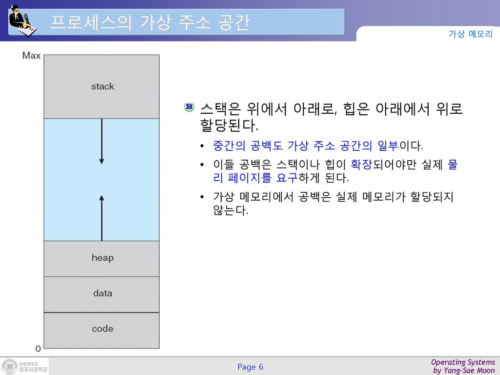

# 메모리 영역

- 프로세스(하디디스크에 있는 실행가능한 파일이 실행된 상태)가 생성되면 운영체제는 메모리를 프로세서에게 할당한다. 
해당 메모리는 커널영역과 유저영역으로 나뉘고, 유저 영역은 다시 가상주소공간으로 나뉜다.
    - 가상 주소공간은 프로세스에 주어지는 메모리 공간

## 코드 세그먼트
- 프로그램의 인스트럭션이 저장되는 공간이다. 함수정의는 컴파일을 거치면서 인스트럭션이 되고, 이 인스트럭션은 
프로세스가 실행되면서 코드 세그먼트에 올라간다. 
예를들어 우리가 작성한 함수나 클래스 정의 코드는 인스트럭션으로 변환되어 하드디스크에 저장되어 있다가 프로세스가 실행되면 
코드 세그먼트에 올라가는 것이다.

## 데이터 세그먼트
- 전역 변수가 저장되는 공간이다. 프로세스가 실행되면 전역변수는 데이터 세그먼트에 올라가고 프로세스가 종료되면 
소멸하기 때문에 프로그래머가 생성, 소멸 시기를 결정할 수 없다.

## 스택 세그먼트
- 지역 변수가 저장되는 공간이다. 지역 변수가 저장된다는 것은 함수를 호출했을때 그 스택프레임(함수의 메모리공간, 지역변수가 존재하는 영역) 
이 스택 세그먼트에 생성된다는 의미이다. 호출한 함수에서 다른 함수를 호출하면 스택프레임이 위에 쌓이고 스택세그먼트가 
아래로 늘어난다. 스택 세그먼트는 런타임동안 늘어났다, 즐어들기를 반복하지만 최대로 늘어날 수 있는 크기가 정해져있어서 
스택 프레임이 쌓이다 최대크기를 넘기면 "스택 오버플로우" 오류가 발생한다.

## 힙 세그먼트
- 힙 세그먼트는 프로그래머가 자유롭게 메모리를 할당하고 해제할 수 있는 공간이다. 
함수 호출이 끝나면 스택 프레임이 사라지면서 해제되는 지역변수와 달리 힙 세그먼트에 할당한 메모리는 해제하지않는 한 
메모리 공간에 계속 남아있다. 메모리를 할당한 후 해제하지 않아 메모리가 계속 남아있는 상황을 메모리 누수라고 한다. 
만약 함수가 종료되고, 해당 변수가 사라지면 해당 메모리에는 접근할 수 없으므로 메모리 낭비가 일어난다.
    - 잦은 할당과 해제는 메모리의 빈공간을 잘게 나눈다. 그러면서 데이터가 한군데에 모이지 못하고 멀리 떨어져 저장된다. 
    이를 메모리 단편화라고 하고, 지역성의 원리가 적용되지 못해 캐시 미스가 발생하고 페이지 폴트가 발생해 성능을 악화시킨다.
    

# 가상 메모리
- 우리는 가상 메모리를 통해 한정된 메모리로 여러 프로세스를 실행할 수 있다. 
    - 한정된 사이즈의 메인 메로리를 확장하기 위해 페이지 파일로 불리는 하드디스크의 일정부분을 메인 메모리처럼 사용하는 것을 
    말하고, 메인 메모리(RAM)와 하드디스크의 페이지 파일을 합쳐 물리메모리라고 한다.
    
- 물리 메모리부터 사용자 관점의 논리 메모리를 분리시켜 주 메모리를 균일한 크기의 저장공간으로 구성된 
엄청나게 큰 배열로 추상화시켜 작은 메모리로 큰 가상 주소공간을 제공한다. 